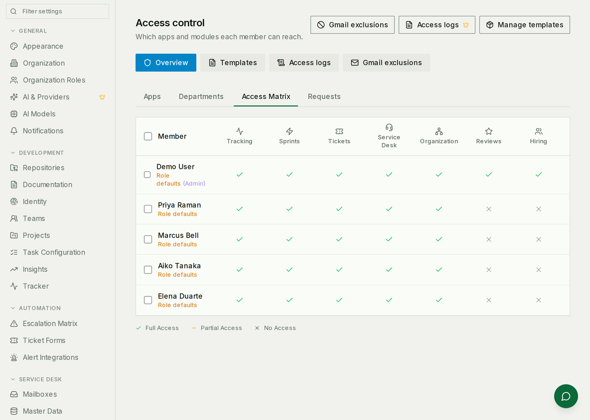
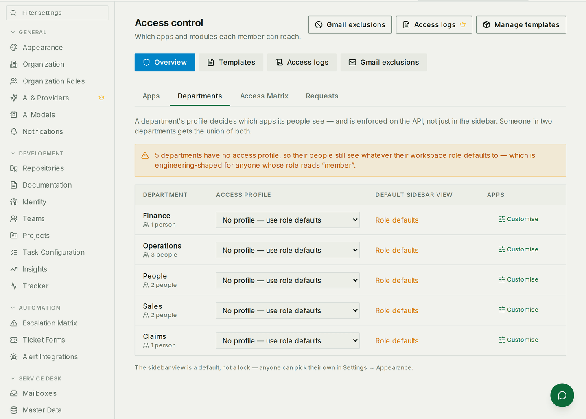

# Roles, permissions and app access

Why two colleagues open the same product and see different things — and how to
change it deliberately rather than by trial.

## Two different questions

They get confused constantly, and almost every access problem is one of them
being mistaken for the other:

| Question | Answered by |
|---|---|
| *What may this person do?* | Their **workspace role** — owner, admin, member, viewer |
| *What may this person open?* | Their **app access** — resolved from several layers below |

An admin with no access to the Service Desk does not see it in their sidebar. A
member with access to everything sees everything and can change very little.
Both are working as designed.

**Switching an app off for the workspace closes it.** The API refuses, for
everybody — including admins and the owner, because "this workspace does not
use this module" has to beat administrator reach. That is the one setting on
this page that is a boundary rather than a preference.

Two things it does not close, and should not. **Workspace administration keeps
working** whatever is switched off — members, invitations, roles, billing and
the app toggles themselves — because somebody locked out of the access page
cannot ask for access back. And **a couple of modules are not workspace-scoped
at all**: tracking and learning records belong to the person they are about, so
a request to those names no workspace whose toggle could apply. Switching those
off removes them from navigation and nothing more.

**The other layers shape navigation more than they restrict reach.** Where
nothing has been configured for somebody — their departments carry no profile
and nobody has written them an override — the role bundle decides what appears
in their sidebar, and the API still answers. That is deliberate: enforcing a
default that nobody chose would lock people out of modules they use today.
Reach follows configuration, so a department profile or an explicit override is
what actually restricts somebody.

Admins and owners keep reach over everything the workspace has enabled, even
where their own profile keeps a module out of their sidebar — they have to be
able to administer it.

## Workspace roles

| Role | Can |
|---|---|
| **Owner** | Everything, including deleting the workspace and choosing which apps exist |
| **Admin** | Manage members, invitations and settings |
| **Member** | Do the work — create, edit, comment |
| **Viewer** | Read |

Roles are set on the member list at **Settings → Organization**, and one person
holds one role per workspace.

Viewers are more restricted than people expect: several modules require at
least a member to reach them at all, so a viewer is not "a member who cannot
save" — there are pages they simply do not get.

## Where app access comes from

**Settings → Access** is the answer to "why can they open that?". Every member
is a row, every app a column, and each cell says full, partial or none — with a
label under the name saying *which layer decided it*.

The layers, outermost first:

1. **The workspace app switch.** Off means off, for everybody, whatever the
   rest of this list says. Owner-only, and the **Apps** tab of this same page
   — the tabs are in this list's order, so the leftmost is the outermost.
2. **Department access profiles.** A department carries a named bundle of apps;
   somebody in several profiled departments gets the **union** of them.
3. **The role default**, used when none of their departments carries a profile.
   Not a lesser path — it is what a workspace that has never used profiles runs
   on, and it keeps working exactly as before.
4. **A template or an override on the person**, for the individual exception.

That is why the matrix labels most rows *Role defaults*: nothing more specific
has been said about them yet.

The Departments tab is where the second layer is edited. Giving a department a
profile changes what everybody in it can open — including people added to it
next month, which is the reason to prefer it over per-person overrides.

If a profile change appears to do nothing, check the Apps tab first: layer one
overrules layer two, and an app switched off for the workspace cannot be
granted back by any profile.

## Asking for access

Somebody who cannot open an app can request it, and the request appears under
**Settings → Access → Requests** for an admin to grant or refuse. It beats the
alternative, which is a message that says "I can't see the CRM" with no record
of who asked or what happened next.

## Project permissions are separate

Projects carry their own per-project roles, on top of all of the above. Access
to the Sprints app says you can open the module; a project's own membership
decides what you can do inside that project. If somebody can see the module but
not a particular board, that is where to look.

## Common mistakes

- **"I'm an admin, why can't I see it?"** The app is switched off for the
  workspace, or their department's profile does not include it. Being an admin
  is not an override.
- **Expecting a role default to keep somebody out.** Until a department profile
  or an override says otherwise, the sidebar hides the module and the API does
  not. Configure it rather than relying on the default.
- **Fixing it with a per-person override.** It works, and it is invisible six
  months later. Fix the department profile unless the person really is an
  exception.
- **Expecting a role change to change the sidebar.** If their department
  carries a profile, the profile is the baseline and the role default is not
  consulted.
- **Testing with a viewer.** Several checks bite only at member level, so a
  viewer can pass or fail for the wrong reason. Test the case you actually mean.
- **Assuming the matrix is the whole story for projects.** It is not — see
  above.
