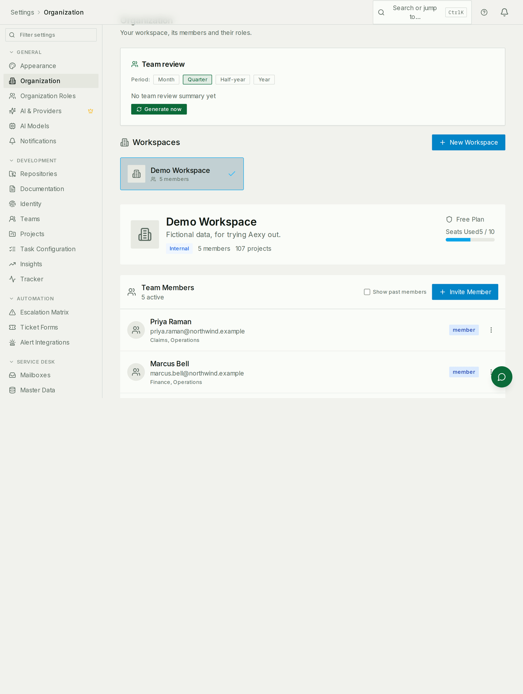
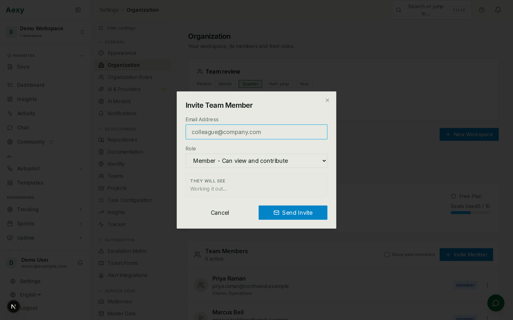

# Setting up a workspace

The first hour, for whoever is setting Aexy up for other people. Everything
here is done from **Settings**, and none of it needs a developer.

If you are looking for how to *run* Aexy locally — Docker, migrations, the
stack — that is [Getting Started](./getting-started.md), which is a different
document for a different reader.

## What a workspace is

Everything belongs to one: people, tickets, projects, documents, settings. You
get one when you sign up, and most organisations only ever need the one.
Somebody can belong to several, and the switcher at the top of the sidebar
moves between them.

Four steps, in this order, and the order matters: **people → apps →
departments → modules**. Skipping straight to a module is the usual reason a
module looks broken later.

## 1. Invite the people

**Settings → Organization** lists everybody and their role, with pending
invitations underneath.

An invitation is an email address and a role:

| Role | What it means |
|---|---|
| **Owner** | Full access, and the only role that can delete the workspace or change which apps are switched on |
| **Admin** | Manages members and settings |
| **Member** | Views and contributes — the ordinary working role |
| **Viewer** | Read-only |

The role is not the same thing as "which apps do they see" — that is
[Roles & access](./roles-and-access.md), and it is worth reading before you
invite twenty people.

An invitation can also place somebody in a department as it is accepted, which
saves doing it twice. If you have not built the departments yet, invite first
and place afterwards; nothing is lost.

## 2. Switch on the apps you will use

Aexy ships a lot of modules. A workspace that turns on all of them gets a
sidebar nobody can navigate, so **Settings → Access Control → Apps** is where
you decide which exist at all. It sits alongside the department profiles and
the member matrix because it overrules both: the three tabs read left to right
in the order access actually resolves.

Two things to know:

* **Only the owner can change this.** Admins manage people; the app list is the
  owner's.
* **Switching an app off closes it for everybody**, whatever their role or
  department — the module disappears from navigation *and* its API refuses,
  admins and the owner included. It is the outermost gate, which also makes it
  the first thing to check when somebody cannot reach a module they are sure
  they have access to.

## 3. Build the departments

Departments are where somebody sits, and — more importantly — what they can
see. A workspace with no departments works, but several modules quietly depend
on them:

* App access can be granted by department rather than person by person.
* The Service Desk decides who may see a ticket from the department that owns
  its pending-with bucket.
* The directory groups people by it, and the org chart is it.

The full guide is [Organization](../organization.md). The short version: create
a department, give it a **function** where one applies, put people in it, and
name a head.

**Nobody is placed automatically.** Somebody invited last week is in no
department until you put them in one, and a person in no department is
invisible to everything above.

## 4. Set up the modules you turned on

Each module has its own first-run steps. The ones with real setup:

| Module | What it needs before it is useful |
|---|---|
| [Service Desk](../service-desk.md) | A mailbox, master data with domains, pending-with buckets, working hours |
| [Leave](../leave.md) | Types, policies, a holiday calendar, and this year's balances |
| [Tickets](../tickets-and-projects.md) | A form, and its public link |
| [Sprints](../sprints.md) | A project and a team |
| Email | Sending domains and, for inbound, a connected account — see [Email setup](./email-setup.md) |

## Common mistakes

- **Inviting everybody before deciding on departments.** It works, but somebody
  has to go back and place twenty people by hand.
- **Turning on every app "to see what they do".** The sidebar is the cost, and
  it is paid by everyone else.
- **Assuming a role grants app access.** It provides a default, and a
  department profile overrides it. Two people with the same role can see
  entirely different products.
- **Setting up a module before its department exists.** The Service Desk is the
  clearest case: its buckets point at departments, so it has to be built after
  them.
