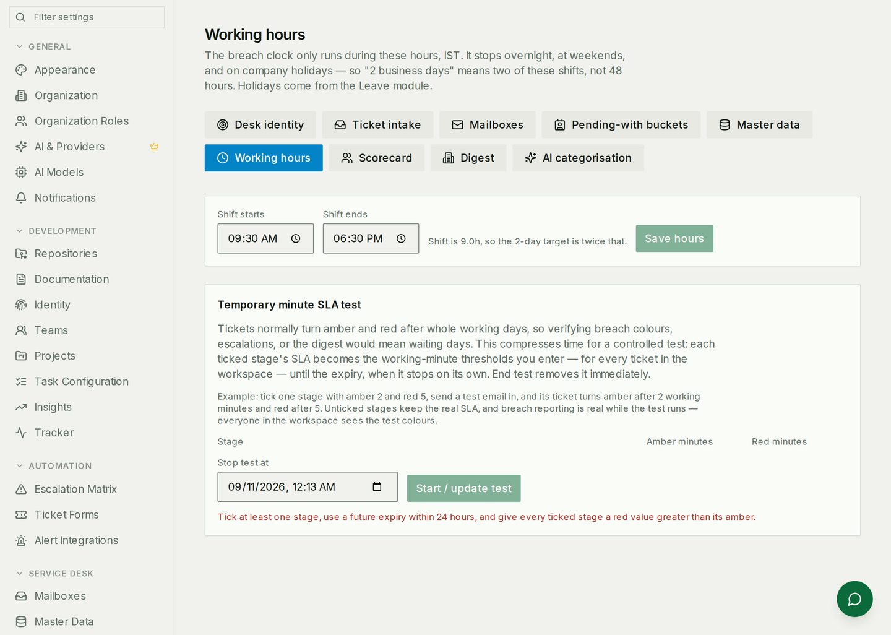

# Service Desk

A shared mailbox becomes a queue. Mail arrives, becomes a ticket, and moves
between the people and companies responsible for it until it is closed — with
the time spent on each side of every handoff recorded, so "we were waiting on
the insurer for nine days" is a fact rather than an argument.

This guide is for setting up and running a desk. For how it is built —
routers, models, the intake pipeline — see
[Service Desk architecture](./service-desk-architecture.md).

## The one idea to get right first

Every other module here gives a ticket an **assignee**: one person who owns it.
A service desk ticket has that too, but the field that runs the desk is
**pending with** — the party who owes the next action, which is frequently not
your company at all.

A ticket can be pending with your operations team, then an insurer, then the
customer, then back to operations. Each of those is a **stage**, and the desk
records when each one started and ended. That ledger is where the reports, the
breach clock and the whole point of the module come from.

Pending-with is not a status. Closing a ticket does not clear it, and moving it
between parties does not reopen it — the two answer different questions and
both are kept.

## Setting up

### 1. Add the mailbox

Everything sent to a registered address becomes a ticket.

Two ways mail can reach the desk, chosen per mailbox at
**Settings → Service Desk → Mailboxes**:

| Channel | What it needs | Use it when |
|---|---|---|
| **Inbound webhook** | Your provider (Postmark, SES, SendGrid, Mailgun) pointed at Aexy's inbound endpoint | The address's mail already routes through one of those |
| **Gmail sync** | That exact address connected as a Google account | The desk runs on a Google Workspace inbox |

Gmail sync is refused unless the address you are adding is one of the connected
accounts — the desk will not claim to read an inbox it cannot open.

**Nothing arrives until the provider is actually pointed at the endpoint.** A
mailbox row on this page is Aexy's half of the arrangement, not both halves.

### 2. Fill in the master data

This is the part that decides where mail lands, and the part most often left
half-done.

Three tables, all at **Settings → Service Desk → Master Data**:

* **Accounts** (labelled with whatever your industry template calls them —
  "Partners" above) — who the desk works for. Each one owns **email domains**,
  and the sender's domain is how an incoming message finds its account and its
  owner. A whole address can be used instead of a domain, and beats a domain
  entry, which is how you separate several customers who all write from
  `gmail.com`.
* **Vendors / insurers** — outside parties you send work *to*. Mail from these
  domains is read as somebody replying about existing work rather than a
  customer raising something new.
* **Products / lines of business** — what a ticket can be about.

An account with no domain routes nothing. That single omission is the most
common reason a desk looks like it is ignoring a customer.

### 3. Name the parties a ticket can wait on

**Settings → Service Desk → Pending-With Buckets.** Each bucket is either
**internal** — owned by a department, which is what decides who can see those
tickets — or **external**, a counterparty nobody in your organisation owns.

A bucket cannot be deleted while any ticket or any closed stage still names it;
untick *Active* instead. The history stays readable and the bucket disappears
from the pickers.

### 4. Set the clock

A turnaround target is stated in **working days**, and the desk means it
literally: the clock accrues only inside the shift you define here, in the
workspace's own timezone, and stops overnight, at weekends, and on the holidays
already recorded in the Leave module.

So "2 working days" is 18 hours of desk time on a 09:30–18:30 shift, not 48
hours of wall clock. A ticket that arrives on Friday afternoon is not breaching
on Sunday morning.

Getting the timezone wrong is not a rounding error — whether an instant falls
inside Tuesday's shift depends entirely on which timezone you ask in.

### 5. Decide about AI classification

**Settings → Service Desk → AI.** With it on, an incoming email is read and a
request type and product are proposed. Below the confidence threshold the
ticket is flagged **needs triage** rather than quietly mis-filed, and
classification never blocks a ticket from being created.

The desk follows the workspace's AI setting and can veto it locally: if AI is
on for the workspace but you would rather owners classify by hand, switch it
off here without touching anything else.

## Running the desk

### The queue board

The dashboard is the desk's answer to "where is everything?" — a matrix of
open tickets by who they are pending with and how long they have been there,
with the over-target column in red, and the open tickets themselves below it.
Both the matrix and the list can be exported as CSV.

### Working the list

The Tickets tab is the same population with filters on it — by pending-with,
by account, by request type, by owner, by status.

Not everything arrives by email. A request taken on the phone or WhatsApp is
logged by hand:

The dropdowns are the desk's own master data, and a manually logged ticket goes
through the same intake as an email — same routing, same clock, same reports.
It can raise the work in a project at the same time.

### Handing a ticket on

Moving a ticket closes the current stage and opens a new one. The optional note
is written into the ticket's timeline, so the reason survives the person who
had it.

The timeline is the ticket's whole history in the order it happened. The last
entry has no end because it is still running.

Two neighbours of this control worth knowing:

* **Split** — one email often contains two requests. Splitting creates a child
  ticket with its own pending-with and its own clock, while the thread stays
  linked to the parent.
* **Convert to task** — when the work belongs in a project rather than on the
  desk, the ticket keeps its own life and gains a link to the task.

### Reading the clocks

Every ticket carries two numbers, and they deliberately disagree:

* **Overall TAT (elapsed)** — wall clock, weekends included. The requester
  really did wait through the weekend, and pretending otherwise would flatter
  the desk.
* **Current stage (working days)** — desk time only, on the clock configured
  above. This is what the breach target is measured against and what turns the
  dashboard cell red.

Below them, the time this ticket has spent with each party in turn — which is
usually the fastest way to answer "why has this taken three weeks?"

### The digest

**Settings → Service Desk → Digest.** On by default: everyone on the desk gets
their own open tickets, the desk lead gets all of them, at the local hours you
choose. Additional recipients outside the desk department receive the *whole*
desk's open tickets, subjects and account names included, so add those
carefully.

Unchecking somebody stops the mail without changing how work is routed to them.

## Reports

### Turnaround per ticket

One row per ticket, one column per party the desk can wait on, and the working
time each of them held it. The columns come from your own stakeholder list, so
a desk that adds a "Legal" bucket gets a Legal column without anybody changing
the report.

The line above the table states the clock the figures are on — the length of a
day and the breach target — because a turnaround number means nothing without
it.

### The owner scorecard

Each owner scored on the KPIs your desk has enabled, weighted into one number
and a rating band. Out of the box: productivity relative to the desk average,
first response time, handshake efficiency (how many times a ticket changed
hands before it closed), owner-attributable turnaround, zero-breach rate and
not-reopened rate.

Two things worth knowing before anyone is judged by it:

* **A missing measure is never scored as zero.** An owner with no eligible
  tickets for a KPI is scored on the weight that did apply, and the report says
  what proportion that was.
* **Some KPIs are relative to the desk.** Productivity compares an owner to the
  cohort, so it is computed across every owner even when you can only see your
  own row — a cohort of one would read 100 forever.

Weights, targets, bands and thresholds are all editable at **Settings →
Service Desk → Scorecard**, and a desk can define its own KPI there from a
fixed vocabulary of fields and filters — no formula language to learn, and no
way to write one that the report cannot compute.

## Automating the desk

The desk fires three automation triggers, and offers three actions, so routine
handling can be written once in the no-code builder at **Automations** rather
than done by hand on every ticket.

| Trigger | Fires when |
|---|---|
| `service_desk.ticket_created` | The desk opens a ticket, from mail intake or manual logging |
| `service_desk.ticket_updated` | A ticket's request type, owner, account or another field changes |
| `service_desk.pending_with_changed` | A ticket is parked with a different stakeholder |

Every one carries the same fields — `trigger.ticket_id`, `ticket_number`,
`title`, `status`, `priority`, `request_type`, `pending_with`, `account_id`,
`assigned_owner_id`, `source`, `needs_triage` — so a workflow built against one
reads the same way against the others. `ticket_updated` adds
`trigger.changed_fields`; `pending_with_changed` adds
`trigger.previous_pending_with` and `trigger.note`.

| Action | Does |
|---|---|
| `set_pending_with` | Parks the ticket with a stakeholder, with an optional note |
| `set_request_type` | Sets the request type, from the workspace's taxonomy |
| `assign_owner` | Assigns the ticket to a workspace member |

Two things keep this from looping. An update that changes nothing is not an
event, so an automation that re-applies the value it was triggered by stops
there. And automation-caused events nest two deep at most — enough for "triage
sets the type, then routing assigns an owner", and not enough for a cycle.

`trigger.needs_triage` is the useful one to build on: it marks the tickets the
classifier was not confident about, which is exactly the set a person or an
agent should look at. An AI agent can be pointed at the same work — see
[AI agents](./ai-agents.md#agent-schedules) for running a triage or turnaround
pass on a clock.

## Who sees what

Three answers, and a person gets exactly one of them:

| Scope | Who has it | What they see |
|---|---|---|
| **All** | Anyone who may manage the service desk | Every ticket on the desk |
| **Function** | Members of a department that owns a pending-with bucket | Tickets pending with their own buckets, plus tickets assigned to them |
| **None** | Somebody in no department | Nothing — which looks exactly like a quiet day |

That last row is the one that generates support questions. The Tickets page
distinguishes the two cases explicitly: an empty desk says so, and "you are in
no department" says that instead. Fixing it is an Organization job — put the
person in a department, and give that department a function.

## Where each setting lives

| Page | What it configures |
|---|---|
| Mailboxes | Shared addresses and how their mail reaches Aexy |
| Master Data | Accounts, vendors, products and their domains |
| Pending-With Buckets | The parties a ticket can wait on, and which department owns each |
| Intake | Routing and auto-assignment |
| Working hours | The shift, the timezone, the breach target |
| AI | Categorisation and its confidence threshold |
| Digest | Whether it sends, when, and to whom |
| Scorecard | KPIs, weights, bands, custom definitions |
| Identity | The From address replies are sent as |

## Common mistakes

- **An account with no domain.** Routing matches domains; a customer whose
  domain is not registered lands on the fallback owner, and it looks arbitrary
  because it is.
- **A mailbox added but never pointed at.** The provider has to be configured
  to deliver to Aexy's inbound endpoint. Adding the row does not do that.
- **Reading the two clocks as one.** Overall TAT includes the weekend; stage
  figures do not. They are supposed to differ.
- **Treating "needs triage" as an error.** It means the classifier was not
  confident enough to file the ticket on its own. Working that queue is how the
  classifier gets better.
- **Deleting a bucket that history still names.** Retire it instead — the
  refusal is protecting closed tickets whose stages point at it.
