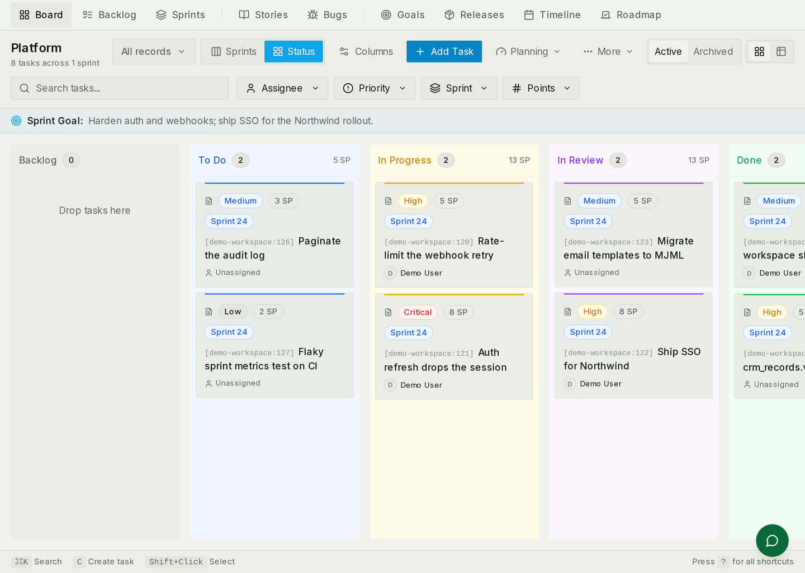
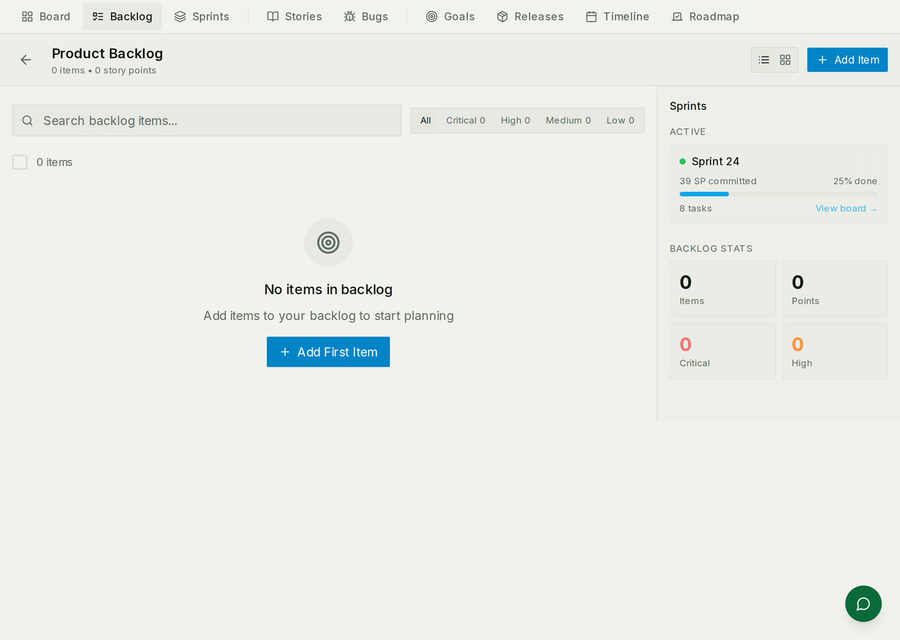
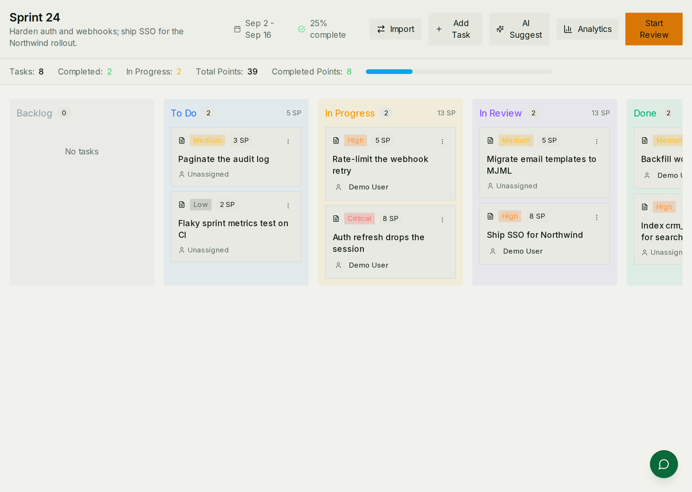

# Sprints & planning

Planning work, running it in cycles, and seeing where it got to. Opinionated on
purpose: a sprint moves through fixed states, and a team runs one at a time.

For how it is built — endpoints, models, external issue sync — see
[Sprints & planning architecture](./sprints-architecture.md).

## The pieces

| | What it is | Lives for |
|---|---|---|
| **Epic** | Large work spanning several sprints | Months |
| **Story** | One user-facing requirement under an epic | Weeks |
| **Task** | The unit somebody actually picks up | Days |
| **Sprint** | A time-boxed cycle owned by a team | One cycle |
| **Release** | A curated bundle to ship, with its own readiness checklist | Until it ships |

Only tasks are compulsory. A team can run sprints with a flat list of tasks and
add epics and stories when the work is big enough to need them; nothing forces
the hierarchy on you.

## The board



The board is where most of the week happens. Columns are the workspace's
statuses, each card carries its priority, its estimate and its assignee, and
the sprint goal sits above the columns so it is visible while people move
cards.

Along the top: filters by assignee, priority, sprint and points, a switch
between grouping by status and by sprint, and a table view for when you would
rather read the same work as rows.

Cards are dragged between columns; the keyboard shortcuts along the bottom of
the screen do the same thing faster (`c` creates a task, `?` lists the rest).

## The backlog



Everything not yet committed to a cycle. Planning a sprint is mostly moving
things from here into it — and the discipline that makes the board useful is
leaving work here until somebody agrees to do it.

## Running a cycle



A sprint moves through five states, and the transitions are deliberate rather
than implied by dates:

```
planning → active → review → retrospective → completed
```

* **Planning** — the only state a sprint can be deleted in. Fill it from the
  backlog, agree a goal, estimate.
* **Active** — one per team. Starting a second while one is running is refused,
  which is the point: a team with two active sprints has neither.
* **Review** — what got done, what did not.
* **Retrospective** — the conversation about how it went, recorded against the
  sprint rather than in somebody's notes.
* **Completed** — closed, and counted in velocity.

Unfinished work does not evaporate at the end. **Carry over** moves it to the
next sprint and stamps where it came from, so velocity attributes it to the
cycle that finished it rather than the one that started it.

Starting and completing a sprint both raise automation events, so a workspace
can announce a sprint in chat or snapshot its metrics without anybody
remembering to.

## Estimating together

Planning poker runs live: start a session on a sprint, add the tasks to
estimate, and everyone votes on the same task at once. Each round goes
**vote → reveal → agree → next**, and finalising the session writes the agreed
estimates onto the tasks themselves.

Every round is recorded, so somebody whose connection drops rejoins where the
room got to rather than where they left.

## Work from GitHub, Jira or Linear

Tasks can come from an external tracker instead of being typed here, and
changes flow both ways. Two things follow from that, and both surprise people:

* A synced task is briefly **pending** while a change is on its way out. If the
  other system is unreachable it can sit in **conflict** until it reconciles —
  that is the sync being honest, not a bug.
* The connection owns its own cursor. Editing those rows directly in the
  database — or through anything that bypasses the sync — is how a workspace
  ends up with two versions of the truth.

## Moving work to another project

A task sometimes belongs on a different board — the Ops team logs it, the Tech
team does it. **Move to project…** in the task's detail creates a copy on the
destination board and links the two. You choose what happens to the original:

- **Leave the original as it is** (the default) — it stays open on its board,
  untouched. Use this when both teams keep working: Ops tracks the request,
  Tech tracks the fix.
- **Archive original** — hidden from the board, restorable from the archive.
- **Mark original as Done** — stays visible in the Done column.

**Keep description, comments and attachments in sync** is on by default,
except when you archive the original — an archived task is off every board, so
there is nothing to keep in step, and the option is disabled. While sync is
on, the two tasks share those three things: rewrite the description on
either board and the other follows; an update or comment written on one is
read on the other, labelled with where it was written; a file attached to one
appears on both, and removing it removes it from both. Nothing else is shared
— status, assignee, dates and points belong to each board, because the point
of the move is that the two boards run the work independently.

With sync off you get the older behaviour: the copy starts with a *Moved from*
line, the closed original gets a *Moved to* line, and from then on they drift
apart. Either way the pair appear under **Linked tasks** in the task's detail.

An edit made in Jira or Linear counts as an edit: if the task is synced with
another, the imported description reaches both. The receiving task's history
records the change with no author, because nobody in Aexy typed it.

A ticket that was converted into a task follows the same rule with its task:
internal notes on the ticket become comments on the task and vice versa,
progress updates read across, and uploads appear on both. The requester's own
words — the ticket body — are never overwritten from the task. The ticket page
has a switch to turn the sync off.

## Common mistakes

- **Two active sprints.** The second start is refused. If a team feels it needs
  two, it usually needs two teams.
- **A backlog used as a board.** Work stays in the backlog until somebody
  commits to it; a board full of uncommitted work stops meaning anything.
- **Deleting a sprint that has started.** Only a *planning* sprint can be
  deleted. A started one is a record of what happened.
- **Estimating in the sprint that is running.** Estimate in planning; poker
  writes back to tasks, and rewriting estimates mid-cycle makes velocity
  meaningless.
- **Expecting dates to move sprints.** Nothing transitions on a calendar. The
  states are explicit because "is this sprint over?" should have one answer.
