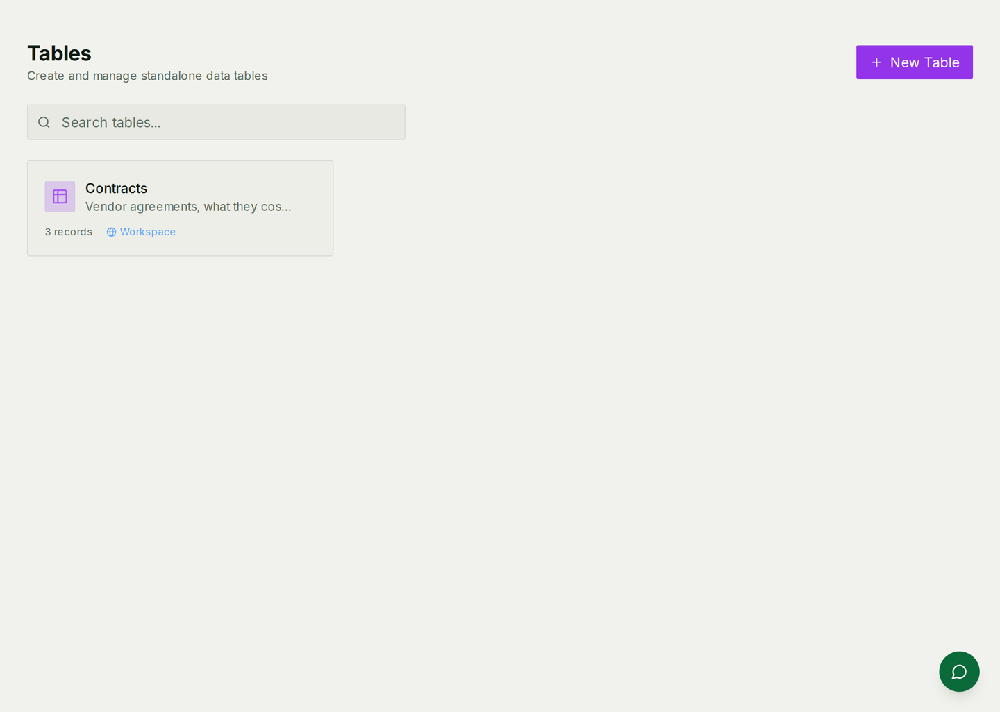
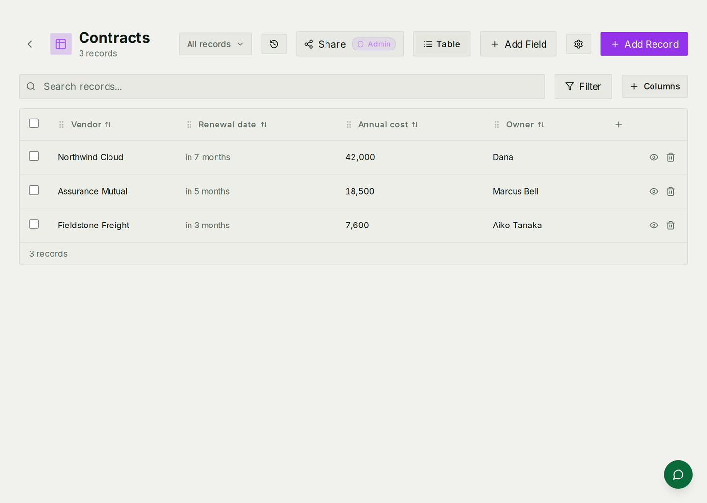

# Tables

A place to keep the things every organisation has and no product has a screen
for: contract renewals, equipment, suppliers, applications, the spreadsheet
somebody has been maintaining since 2023.

For how it is built — the shared storage, view types, access modes — see
[Tables architecture](./tables-architecture.md).

## Tables and the CRM are the same machinery

Your CRM's Companies, People and Deals appear in this list, because a CRM
object and a table are the same thing seen through different lenses. What
differs is **scope**: a CRM object belongs to the CRM's own navigation and its
pipelines; a standalone table belongs here.

That has one practical consequence: **a standalone table cannot be promoted
into a CRM object by editing it.** If something turns out to be a real CRM
concept, make it in the CRM and move the rows. It is a five-minute job the day
you notice and an awkward one a year later.

## Making one

Add a table, add fields, add rows. Fields are typed — text, number, date,
choice, checkbox, a link to a row in another table, or a value the AI computes
from the others — and the type is what makes the column behave: dates sort and
show as "in 7 months", numbers total, choices filter.

Rows can be searched, filtered, and sorted, and the column set is yours.

## Saved views

A view is a filter, a sort and a column selection, kept under a name — "Renewing
this quarter", "Owned by me", "Everything over £10,000".

**Views are shared by default.** Somebody else's "my stuff" view is visible and
editable by anybody with access to the table, which is rarely what they meant.
Mark a personal view private when you make it.

## Who sees which rows

Two separate switches, and they are easy to conflate:

* **Table visibility** — who can open the table at all.
* **Row access** — whether everybody sees every row, or only the ones they own.

**Row access does not apply to workspace admins**, who see everything
regardless. Worth knowing before you promise somebody their rows are private,
and before you generate an "owner-only" report as an admin and wonder why it
has everything in it.

## Deleting

Deleting a single row archives it; it can come back. **Bulk delete removes the
rows for good.** The two buttons look equally reversible and are not.

If the table has auditing switched on — Settings → the table → audit, off by
default — the log keeps one entry per deleted row, including the values it held,
so you can at least see what was removed and by whom. With auditing off there
is no record.

## Common mistakes

- **Building a CRM in a standalone table.** If it has a pipeline and an owner
  and a close date, it is a deal.
- **Personal views that are not private.** They are shared unless you say
  otherwise.
- **Promising row-level privacy from an admin.** Admins see all rows.
- **Reaching for bulk delete to tidy up.** Archive is the reversible one.
- **Renaming the primary field of a table others link to.** Every reference to
  those rows displays by that field, and the displayed names go stale until the
  cache is rebuilt.
