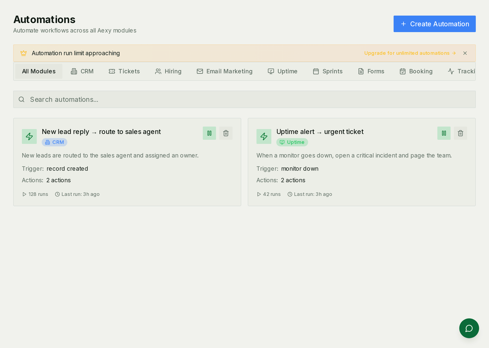

# Workflows & Automations

Aexy has **three overlapping but distinct** ways to "do something when X happens." This doc untangles them.



## The three concepts

| Concept | Where | Granularity | Owner |
|---|---|---|---|
| **Automation** | `api/automations.py`, CRM scope | Trigger → conditions → flat action list | End user (no-code) |
| **Workflow** | `api/workflows.py`, nested inside a CRM Automation | Visual DAG of steps with branches, loops, waits, retries | End user (no-code) |
| **Temporal workflow** | `backend/src/aexy/temporal/workflows/` | Code-defined Python workflows | Backend engineers |

**Rule of thumb:**
- "When a record is created, send a Slack message" → **Automation**
- "When a deal stage changes to negotiation, send email, wait 3 days, if no reply create a task, else end" → **Workflow** (inside an Automation)
- "Sync a GitHub repo: fetch commits, parse, write activity, then re-rank developer skills" → **Temporal workflow**

The first two are user-authored configuration. The third is code. See [temporal.md](./guides/temporal.md) for Temporal workflows.

## Automations

The platform-wide trigger-and-action engine. CRM has the most automations, but the registry is generic — tickets, hiring, email marketing, GTM all expose triggers and actions.

### Endpoints (`api/automations.py`)

```
GET  /workspaces/{ws}/automations/registry/triggers                  what's possible across modules
GET  /workspaces/{ws}/automations/registry/actions
GET  /workspaces/{ws}/automations/registry/modules/{module}/triggers per-module
```

The registry endpoints are used by the no-code builder UI to know what to display. They are not where automations *run* — see `crm_automation.py` for runtime endpoints.

### CRM automations

See [crm.md](./crm.md#automations) for the full doc — triggers, conditions, actions, execution model. Quick reference:

- **Triggers**: record events, scheduled, date-based, external webhooks, communication events (email opened/replied), user events. The `service_desk` module fires `service_desk.ticket_created`, `service_desk.ticket_updated` and `service_desk.pending_with_changed`, and offers `set_pending_with`, `set_request_type` and `assign_owner` as actions.
- **Actions**: record CRUD, send email/Slack/SMS, create task/notification, sequence enrollment, list membership, webhook call, AI enrich/classify/summarize

Automations have `run_limit_per_month`, error-handling policy (`stop` / `continue` / `retry`), and a per-run log (`CRMAutomationRun.steps_executed` JSONB) for observability.

## Workflows (visual DAG inside automations)

When the flat action list of an automation isn't enough — you need branches, loops, conditional waits — promote to a Workflow.

### Endpoints

`api/workflows.py`:

```
GET    /workspaces/{ws}/crm/automations/{automation_id}/workflow
POST   /workspaces/{ws}/crm/automations/{automation_id}/workflow      define
PATCH  /workspaces/{ws}/crm/automations/{automation_id}/workflow      update graph
```

### Models (`models/workflow.py`)

**`WorkflowExecution`** (`workflow.py:55`) — one row per run.

| Field | Note |
|---|---|
| `automation_id`, `workspace_id` | Scope |
| `status` (`WorkflowExecutionStatus`) | `PENDING` / `RUNNING` / `PAUSED` / `COMPLETED` / `FAILED` / `CANCELLED` |
| step-level state | Per-step `WorkflowStepStatus`: `PENDING` / `RUNNING` / `SUCCESS` / `FAILED` / `SKIPPED` / `WAITING` / `RETRYING` |

`PAUSED` is real — workflows can wait on a human action (e.g. "wait for approval") and resume later when the action arrives.

### Execution

Workflows orchestrate via Temporal activities under the hood — `WorkflowService` translates the user-defined graph into activity dispatches on the `workflows` task queue. Steps map to:

- Activity calls (`execute_workflow_action` Temporal activity)
- Branch nodes (server-side condition eval)
- Wait nodes (Temporal timer)
- Loop nodes (re-execute a sub-graph)

`WorkflowExecution.steps_executed` is the authoritative log of what happened — the workflow engine reads/writes this state, and the UI displays it as a visual timeline.

## AI Agent integration with automations

Automations can call AI agents at three points (`api/automation_agents.py:51-94`):

| `trigger_point` | When the agent runs |
|---|---|
| `ON_START` | Before any conditions are evaluated |
| `ON_CONDITION_MATCH` | After conditions pass, before actions |
| `AS_ACTION` | As a step in the action list |

Config:
- `input_mapping` — which automation context to pass to the agent
- `wait_for_completion` — synchronous (the automation pauses until the agent returns) vs fire-and-forget
- `timeout_seconds` — bound the wait

This is how a CRM automation can say "when a lead replies, run the Sales agent to classify the reply, then route based on its output." See [ai-agents.md](./ai-agents.md).

## Agent policies

A separate governance layer for agents — what they can do unattended, and who needs to approve the rest. Permissions answer "may this person touch this?"; policies answer "should an agent, acting for them, do it without asking?".

Evaluated in two places: the CRM agent runtime (per tool call) and the MCP boundary (`services/mcp_governance.py`, per mutating tool call, for every MCP client). Reads are never gated.

### Endpoints

```
GET/POST/PATCH/DELETE /workspaces/{ws}/crm/agent-policies
GET                   /workspaces/{ws}/agent-actions               held actions (admins decide)
POST                  /workspaces/{ws}/agent-actions/{id}/approve   replays under the original grant
POST                  /workspaces/{ws}/agent-actions/{id}/reject
GET                   /workspaces/{ws}/agent-actions/mine           the caller's own requests — the one part reachable over MCP
GET                   /workspaces/{ws}/agent-actions/activity       the ledger of agent writes
```

### Models (`models/agent_policy.py`)

**`AgentPolicy`** with `PolicyType` enum:

| Type | Behavior | Config |
|---|---|---|
| `TOOL_BLOCK` | Refuse the call | selectors (below) |
| `TOOL_REQUIRE_APPROVAL` | Queue the call in `/review`; an admin approves or rejects | selectors |
| `FIELD_RESTRICTION` | Refuse a call whose arguments contain a listed field, at any depth | `{"tool": "update_contact", "blocked_fields": ["email", "body.salary"]}`; `"all_tools": true` (or `"tools": ["*"]`) applies it to every action — an empty `tool` with no `tools` stays inert |
| `RATE_LIMIT` | Refuse once an actor has done this action too often | `{"tool": "send_campaign", "max_per_hour": 20, "max_per_day": 100}` counted from the ledger. With a selector — `{"methods": ["DELETE"], "max_per_hour": 10}` — every row the selector covers counts, so that is ten deletes of any kind, not ten per action. `max_per_execution` applies to the CRM runtime only |
| `TOKEN_BUDGET` | Cap LLM token spend | `{"max_tokens": 50000}` — LLM-side; does not apply at the tool boundary |

**Selectors** for block and require-approval. A policy triggers when *any* of them matches:

```jsonc
{
  "tools": ["update_contact", "send_email"],        // exact action names
  "methods": ["DELETE"],                            // HTTP method of the operation
  "action_patterns": ["(^|_)send(_|$)", "publish"], // regex over the action name
  "capabilities": ["mcp.admin", "mcp.integrations"] // capability the operation belongs to
}
```

`methods` and `capabilities` are known only at the MCP boundary; CRM-runtime calls match on `tools` and `action_patterns`.

`PolicyDecisionType`: `ALLOW` / `BLOCK` / `REQUIRE_APPROVAL` / `RATE_LIMITED`. Non-allow decisions are written to `agent_policy_decisions`.

Policies are workspace-scoped. `agent_id` restricts one to a single CRM agent; `NULL` means every agent, and only those apply over MCP.

### The default pack (`services/agent_policy_defaults.py`)

A workspace with no policies used to allow every mutating operation unattended. Every workspace now starts with three `TOOL_REQUIRE_APPROVAL` rows, seeded on creation, on the first governed MCP call, or by `scripts/backfill_default_agent_policies.py`:

| Default | Holds |
|---|---|
| Deletions need approval | any `DELETE` |
| Outward-facing and irreversible actions need approval | send, publish, invite, remove member, role changes, connect/disconnect integrations, charge/refund/terminate, bulk delete |
| Administration and integration writes need approval | every write in `mcp.admin` and `mcp.integrations` |

Each carries `config.default_key`. **To opt out, deactivate rather than delete**: seeding runs only for a workspace with no workspace-wide policies at all, so a switched-off default is respected while a deleted set looks like an unconfigured workspace.

### Held actions and notifications

A require-approval decision queues a `ProposedChange` of kind `action` and notifies workspace admins and owners (`agent_approval_required`). Approving replays the call as the identity that requested it — a principal's held write is ledgered under that principal — under the capabilities held at queue time. A person who requested it is notified of the outcome (`agent_action_decided`); an agent has no inbox and polls `GET .../agent-actions/mine` instead. A held routine tool (`aexy_sd_park_ticket` and its kind) replays with the arguments it was held with.

### The ledger (`models/agent_action_log.py`)

Every mutating call that reaches the application through the MCP executor is written to `agent_action_logs`: actor (and principal), capability, action, method, resolved path, arguments (whole secret keys such as `token`, `api_key` or `client_secret` masked; `page_token` is not a secret), status code, duration, and the queue entry it replayed if any. The decision log (`agent_policy_decisions`) masks arguments the same way. Reads are never recorded. The `/review` page shows it as "Agent activity"; rate limits count from it.

## Choosing where to put logic

| Need | Use |
|---|---|
| User-defined "X triggers Y" | Automation |
| Multi-step user-defined logic with branches/waits | Workflow (inside Automation) |
| AI-mediated decision in a user-defined flow | Agent embedded via `AutomationAgent` |
| System-internal background work | Temporal workflow + activities |
| Cross-cutting governance over what agents do | Agent policies |

## Frontend

| Route | Purpose |
|---|---|
| `/crm/automations` | Automation list |
| `/crm/automations/new` | Builder |
| `/crm/automations/{id}` | Edit |
| `/crm/automations/{id}/workflow` | Visual workflow builder for that automation |
| `/crm/agent-policies` | Policy administration |

## Common pitfalls

- **Treating an Automation like a Workflow**: as soon as you want a branch or a wait, promote to Workflow. Trying to express branching in a flat action list ends in copy-paste fragility.
- **`PAUSED` workflow stuck.** If a workflow is waiting on a human action that the human never takes, the `WorkflowExecution` sits in `PAUSED` indefinitely. There's no automatic timeout — add an explicit timeout step in the graph.
- **Agent policy evaluation order.** `BLOCK` wins over `REQUIRE_APPROVAL` wins over `RATE_LIMITED` wins over `ALLOW`. If a tool call has multiple matching policies, the most restrictive applies.
- **Run limits silently skip.** `run_limit_per_month` exceeded logs the run as `skipped`, not `failed`. If automations "aren't firing" check skipped runs, not errors.
- **Workflow ↔ Temporal mapping is one-way.** You can author Workflows in the UI and they map to Temporal activities at run time, but you can't go the other way — Temporal workflows in code aren't surfaced in the visual builder.
